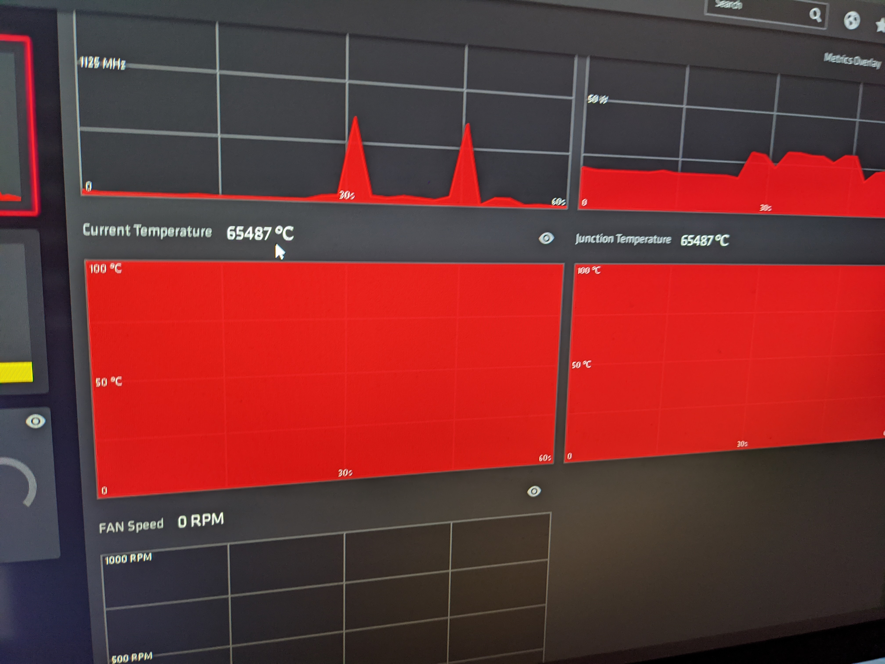

# My computer runs at 65,487 degrees

Join Greg and Jake as they debug a computer which should be on fire!

Released: 11th May 2021.

## What have we been working on?

### Jake's week

(00:18)

+ Designing a new API around private key [JWT](https://jwt.io/)
+ Practising incident drills

### Greg's week

(10:20)

+ Wood working project
+ Admin, taxes and invoices
+ Question: How do deal with the last 5% of project work
+ Server side [DOM](https://en.wikipedia.org/wiki/Document_Object_Model) document implementation
+ Using [Nginx](https://www.nginx.com/) to add functionality to an old [Ruby](https://www.ruby-lang.org/en/) and [ASP](https://en.wikipedia.org/wiki/Active_Server_Pages) project

## My computer runs at 65,487 degrees

(25:20)

+ Jake has been having some computer issues
+ Breaking down the problem
+ Discovering that Jake's computer is running at 65,487 degrees
+ Why the number 65,487 is interesting

## Interesting links

(52:13)

+ Greg: 
 - [ICO-3103](https://en.wikipedia.org/wiki/ISO_3103)
 - [RFC-1149](https://tools.ietf.org/html/rfc1149)
+ Jake:
 - [Plausible Analytics](https://plausible.io/)

