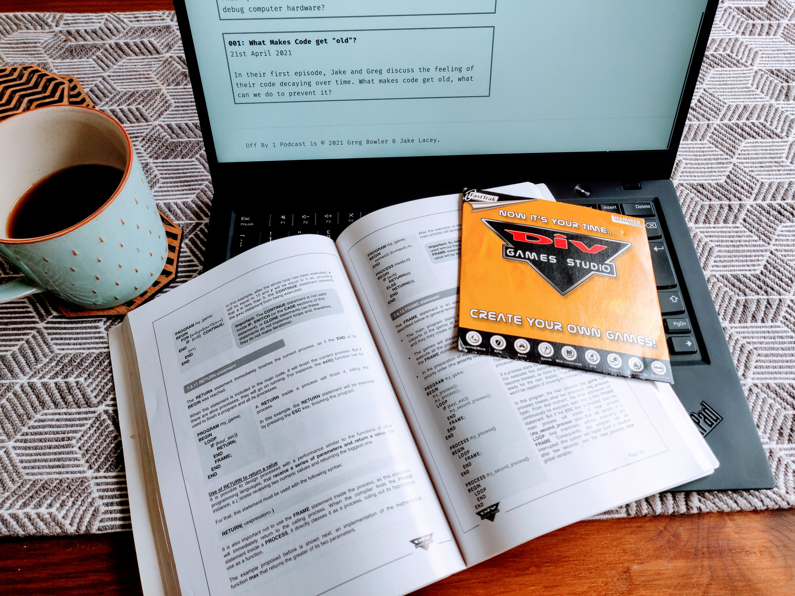

# Text Editors

From Windows Notepad to bull-blown IDEs, what are the features of text editors that you look for? 

Released: 29th Jun 2021.

## What have we been working on?

### Greg's week

(01:48)

+ Open source projects, getting and managing contributions. (https://github.com/PhpGt/Dom, https://github.com/php-actions/composer)
+ Having to deal with stupid contracts for simple work.
+ More HTML Emails!

### Jake's week

(12:28)

+ Continuing with [JWT Client Authentication](https://www.ibm.com/blogs/security-identity-access/oauth-client-authentication-using-jwt/) Designing the API.
+ When is good, good enough?
+ Being made quality 'streets' champion.
+ Wanting to try avoid suggesting things early on.
+ News about the graphics card, and the graphics card market is dead!
+ Graphics card driver issue.
+ Secret side project is deployed, and called [PropHunt.uk](https://prophunt.uk).
+ Why is Jake making PropHunt?

## Text Editors

(35:46)

+ Jake is having issues with his editors.
+ Editors being slow the productivity killer.
+ Jake is migrating to [emacs](https://www.gnu.org/software/emacs/) with [DoomEmacs](https://github.com/hlissner/doom-emacs).
+ Jake's timeline of editors.
+ What is Language Server Protocol (LSP).
+ Greg's timeline of editors.
+ [DIV Games Studio](https://github.com/DIVGAMES/DIV-Games-Studio).
+ 
+ What is the perfect editor?!

## Pick of the Pod

(116:32)

+ [Wintergatan](https://www.youtube.com/user/wintergatan2000)
+ [howtodeal.dev](https://www.howtodeal.dev/)
